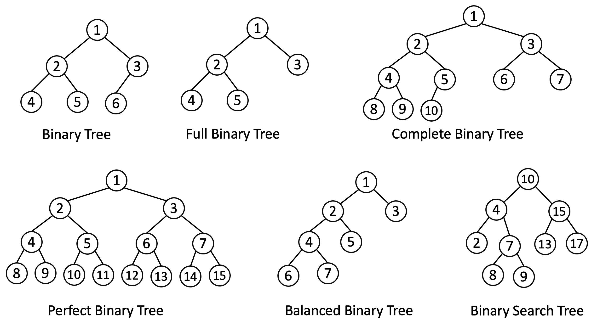

# Data Structure and Algorithm Cheat Sheet
Data Structure &amp; Algorithm cheat sheet

# Table of Content
- [Data Structures](#data-structures)
  - [Array](#array)
  - [Linked List](#linked-list)
  - [Hash Table](#hash-table)
  - [Stack](#stack)
  - [Queue](#queue)
  - [Binary Tree](#binary-tree)
  - [Binary Search Tree](#binary-search-tree)
  - [Heap](#heap)
  - [Self-balancing Trees](#self-balancing-trees)
    - [AVL Tree](#avl-tree)
    - [Red-Black Tree](#red-black-tree)
    - [Splay Tree](#splay-tree)
- [Algorithms](#algorithms)
  - [Sorting](#sorting)
    - [Insertion Sort](#insertion-sort)
  - [Searching](#searching)
  - [Graph](#graph)
  - [Optimization](#optimization)

## Data Structures
Data structure is about organizing data, management, and storage format that enables efficient access and modification.
More precisely, a data structure is a collection of data values, the relationships among them, and the functions or 
operations that can be applied to the data. 


### Array
**Definition:**
Array is a data structure consisting of a collection of elements, each identified 
by at least one array index or key. An array is stored such that the position of each element can 
be computed from its index tuple by a mathematical formula.

**Key points:**
* Data stored in consecutive memory blocks. Each block is identified by index.
* Need to know start memory location/index to access elements.
* Array is homogeneous, store same type of data in each memory block.
* Good for indexing; 
* Bad at searching, 
* Not efficient where insertion happens more frequently at random position inserting - need to shift elements to right after insert position, 
* Not efficient where deletion happens more often - need to shift the elements to left after delete position (except at the end).
* One dimensional or **linear arrays** are static in size, that means size of the array is fixed which needs to be declared on initialization.
* There are one dimensional **Dynamic arrays**, where it have reserves space for additional elements. If a dynamic array is full, it copies its contents to a larger array.

**When it is good to use:**
* Available data is of same type, like `integer`, `string`, `character`... 
* When ordering is required
* Indexing is required

**When it is bad to use:**
* Available data is not same type.

**Time Complexity:**
* Indexing: 
    * Linear array & Dynamic array: `O(1)`
* Search: 
    * Linear array & Dynamic array: `O(n)`
* Optimized Search: 
    * Linear array & Dynamic array: `O(log n)`
* Insertion: 
    * Linear array: `n/a` 
    * Dynamic array: `O(n)`
    
**Space  Complexity:**\
`O(n)`

### Linked List
**Definition:**
Linked list is a linear collection of data. Each element is represented by `node`. Linked list 
doesn't store data in consecutive memory location. Each node stores data and a reference/pointer
to next node. For a linked list the type of data in each node has to be same. Data element  could be
a primitive or composite/object. 

**Key points:**
* Linked list may be circular where last node points to the first node.
* Linked list could be doubly where each node contains the reference of next node and previous node.
* Data is not stored consecutive memory blocks, unlike array. 
* Nodes in a linked list must be read in order from the beginning as linked lists are inherently sequential access.
* Not efficient where insertion happens any location other than start and end. It will need to search the position from beginning.  
* Efficient where deletion happens more often, just need to change the next reference of previous node.

**When it is good to use:**
* When there are heavy insertion & deletion, Linked list provides constant time insertion & deletion.
* By nature memory allocation is dynamic, if not sure about the size of data then linked list is a good choice.
* Don't need random access to data, unlike array, searching starts from beginning/head.
* Insertion in the middle doesn't happen too frequent, complexity is searching the insert position.

**Time Complexity:**
- Indexing: `O(n)`
- Search: `O(n)`
- Optimized Search: `O(n)`
- Append: `O(1)`
- Prepend: `O(1)`
- Insertion: `O(n)`

**Space  Complexity:**\
`O(n)`

### Hash Table
**Definition:**
Hash Table organizes data based on `key` `value` pair. A [hash function](https://en.wikipedia.org/wiki/Hash_function) is used
to compute an index or hash code which identifies the array of buckets or slots. The value can be found from that specific location.

**Key points:**
* Hash table is structured to optimize searching, insertion, and deletion. 
* Hash collisions are when a hash function returns the same output for two distinct inputs.

**When it is good to use:**
* When there are lot of data and you need constant time(`O(1)`) read, write operation.
* Don't need maintain ordering

**Drawbacks**
* Cost of good hashing function could be higher that other lookup algorithms(search tree)
* There are posibility that same key my get assigned to different values, this is called hash collisions. 
    - [Consistent hashing](https://en.wikipedia.org/wiki/Consistent_hashing) could resolve hash collision/conflict.

**Time Complexity:**\
Indexing: `O(1)`\
Search: `O(1)`\
Insertion: `O(1)`

**Space  Complexity:**\
`O(n)`

### Stack
**Definition:**
Stack is a linear data structure that follows last in first out(`LIFO`). The item inserted/added last will be accessed
first.

**Key points:**
* Stack maintains order, LIFO
* Stack performs two operations:
    - `PUSH`: add new element in data structure
    - `POP`: remove most recently added element from data structure
    
**When it is good to use:**
* When it is required to keep track of sequence of actions
* Access elements in reverse order
* For backtracking

**Time Complexity:**\
Insertion/Push: `O(1)`
Deletion/Pop: `O(1)`

**Space  Complexity:**\
`O(n)`

### Queue
**Definition:**
A queue is a collection of entities/linear structure that are maintained in a sequence and can be modified 
by the addition of entities at one end of the sequence and the removal of entities from the other end of the sequence. 
By convention, the end of the sequence at which elements are added is called the back, tail
It follows First In First Out (FIFO).

**Key points:**
* Queue maintains order, FIFO
* Queue performs two operation:
    - `Enqueue`: add new element in data structure
    - `Dequeue`: remove oldest element from data structure

**When it is good to use:**

**Drawbacks**

**Time Complexity:**
Insert: `O(1)`\
Search: `O(n)`\
Delete: `O(1)`\

**Space  Complexity:**
`O(n)`

### Binary Tree
**Definition:**
A binary tree is a [tree](https://en.wikipedia.org/wiki/Tree_(data_structure)) data structure in 
which each node has at most two children, which are referred to as the *left child* and the *right child*. 

**Key points:**
- Binary tree is [rooted tree](https://en.wikipedia.org/wiki/Tree_(graph_theory)#Rooted_tree) and [ordered tree](https://en.wikipedia.org/wiki/Tree_(graph_theory)#Plane_tree) in which each node 
  may have at-most two child nodes.
- A binary tree is called *full binary tree* when every node has either 0 or 2 children. A full binary tree is either:
  - A single vertex.
  - A tree whose root node has two subtrees, both of which are **full binary trees**.
- A binary tree is called **complete binary tree** when there are exactly *2^height* nodes at each level except the last level. Last level can have between 1 and *2^height* nodes and nodes are filled as left as possible.
  - Level/height of root node is **zero**,
  - Height of a node in a rooted tree is the length of the longest downward path to a leaf from that vertex
- A *perfect binary tree* is a binary tree in which all interior nodes have two children and all leaves have the same depth or same level.
- A *balanced binary tree* is a binary tree structure in which the left and right subtrees of every node differ in height by no more than **1**.
- A *degenerate tree* is where each parent node has only one associated child node. The tree will behave like a linked list data structure.


**When it is good to use:**
* Binary tree is a good choice when there are relationship between some pair of elements, like `[(a,b),(e,f),(a,d),(b,e)]`
* There is no order between each element

**Time Complexity:**
Here are complexities in general where every node will be checked for searching, 
- Search: `O(n)` 
- Insertion: `O(n)`, insertion is `O(1)` but it will take `O(n)` to find insert position.
- Deletion: `O(n)`,  actual deletion is `O(1)` but it will take `O(n)` to find the node.

**Space  Complexity:**\
`O(n)`



### Binary Search Tree
**Definition:** A binary search tree (BST) is a rooted binary tree whose internal nodes 
each store a key greater than all the keys in the node's left subtree and less than those 
in its right subtree.

**Key points:**
* Binary search tree is an ordered or sorted binary tree.
* All the keys of left subtree is less than the node's key.
* All the keys of right subtree is greater than the node's key.

**When it is good to use:**
* Use when dataset is sorted.
* For searching, binary search trees allow binary search for fast lookup, addition and removal of data items.

**Drawbacks**
* A binary search tree can get out of balance, *degenerate tree*. 

**Time Complexity:**

|   | Average | Worst case |
| ---- | ---- | ---- |
| Search  | `O(log n)`  | `O(n)` |
| Insert  | `O(log n)`  | `O(n)` |
| Delete  | `O(log n)`  | `O(n)` |

**Space  Complexity:**
`O(n)`


### Heap
**Definition:**
A heap is a specialized tree-based data structure which is essentially an almost complete tree that satisfies the heap property:
- in a **max heap**, for any given *node C*, if *P* is a parent node of *C*, then the key (the value) of *P* is greater than or equal to the key of *C*. 
- in a **min heap**, the key of *P* is less than or equal to the key of *C*.

**Key points:**
* A heap is also called the binary heap, in which the tree is a binary tree.
* Heap has following operations:
  - *find-max* (or find-min): find a maximum item of a max-heap, or a minimum item of a min-heap, respectively
  - *insert*: adding a new key to the heap
  - *extract-max* (or extract-min): returns the node of maximum value from a max heap after removing it from the heap
  - *delete-max* (or delete-min): removing the root node of a max heap (or min heap), respectively
  - *replace*: pop root and push a new key. More efficient than pop followed by push, since only need to balance once, not twice, and appropriate for fixed-size heaps.

**When it is good to use:**
* For in-place sorting, like [Heapsort](https://en.wikipedia.org/wiki/Heapsort).
* Find maximum(*max-heap*) or minimum(*min-heap*) element at constant time from a set of elements.

**Time Complexity:**

|  | Operation | find-max | delete-max | insert | increase-key |
| ---- | ---- | ---- | ---- | ---- | ---- |
| Binary | `Θ(1)` | `Θ(log n)` | `O(log n)` | `O(log n)` | `Θ(n)` |


**Space  Complexity:**\
`O(n)`


### Self-balancing Trees

### AVL Tree
**AVL tree** is a self-balancing binary search tree in which each node maintains extra information called a balance factor 
whose value is either `-1`, `0` or `+1`.

**Key points:**
* In AVL Tree, the heights of the two child subtrees of any node differ by at most one.
* Height balanced, not weight-balanced.
* If at any time they differ by more than one, rebalancing is done to restore this property.
* Balance factor of a node  is: 
  - *BF(X) := Height(RightSubtree(X)) - Height(LeftSubtree(X))*, `BF(X) ∈ {1, 0, -1}`


**Time Complexity:**
| Algorithm	| Average | Worst case |
| ---- | ---- | ---- |
Search | `O(log n)` | `O(n)` |
Insert | `O(log n)` | `O(log n)` |
Delete | `O(log n)` | `O(log n)` |

### Red-Black Tree
A **red–black tree** is a kind of self-balancing binary search tree in which each node stores an extra information representing "color" ("red" or "black").
Color is used to ensure that the tree remains balanced during insertions and deletions.

## Algorithms

## Sorting
### Insertion Sort
Insertion sort is efficient comparison sort. In each iteration it removes an element from the input 
data set and inserts into the correct position in the list being sorted. The choice of the element
being removed from the input is random and the process is repeated until all the input elements have
removed/gone through.

**Pseudocode**
```
i ← 1
while i < length(A)
    x ← A[i]
    j ← i - 1
    while j >= 0 and A[j] > x
        A[j+1] ← A[j]
        j ← j - 1
    end while
    A[j+1] ← x
    i ← i + 1
end while
```

[Implementation](./java/src/com/dsalgo/sorting/InsertionSort.java)
 
**Advantages**
* In-place sorting, It requires only a constant amount *O(1)* of additional memory space.
* Efficient for small data.

**Complexity**
- Best case: *O(n)*
- Average: *O(n^2)*
- Worse case: *O(n^2)*


